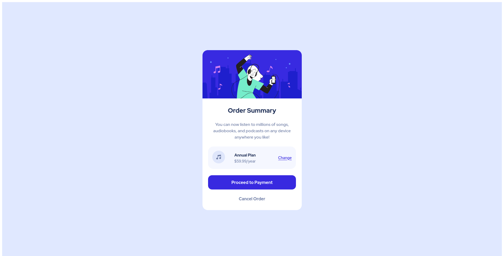

# Frontend Mentor - Order summary card solution

This is a solution to the [Order summary card challenge on Frontend Mentor](https://www.frontendmentor.io/challenges/order-summary-component-QlPmajDUj). Frontend Mentor challenges help you improve your coding skills by building realistic projects.

## Table of contents

- [Overview](#overview)
  - [The challenge](#the-challenge)
  - [Screenshot](#screenshot)
  - [Links](#links)
- [My process](#my-process)
  - [Built with](#built-with)
  - [What I learned](#what-i-learned)
  - [Useful resources](#useful-resources)
- [Author](#author)
- [Acknowledgments](#acknowledgments)

## Overview

### The challenge

Users should be able to:

- See hover states for interactive elements

### Screenshot



### Links

- Solution URL: [Solution](https://www.frontendmentor.io/solutions/order-summary-component-ZYsYUUxeL)
- Live Site URL: [Order Summary Component](https://lisviks.github.io/order-summary-component-frontendmentor/)

## My process

### Built with

- Custom CSS properties

### What I learned

To create CSS variables, first declare them on the `:root` pseudo-class, which will allow to use them globally.

```css
:root {
  --pale-blue: hsl(225, 100%, 94%);
}
```

Use CSS variables

```css
.container {
  background-color: var(--pale-blue);
}
```

### Useful resources

- [CSS Custom Properties](https://developer.mozilla.org/en-US/docs/Web/CSS/Using_CSS_custom_properties) - This helped me with CSS variables.

## Author

- Website - [Deividas Rimkus](https://github.com/Lisviks)
- Frontend Mentor - [@Lisviks](https://www.frontendmentor.io/profile/Lisviks)
- Twitter - [@Lisvikus](https://www.twitter.com/Lisvikus)
